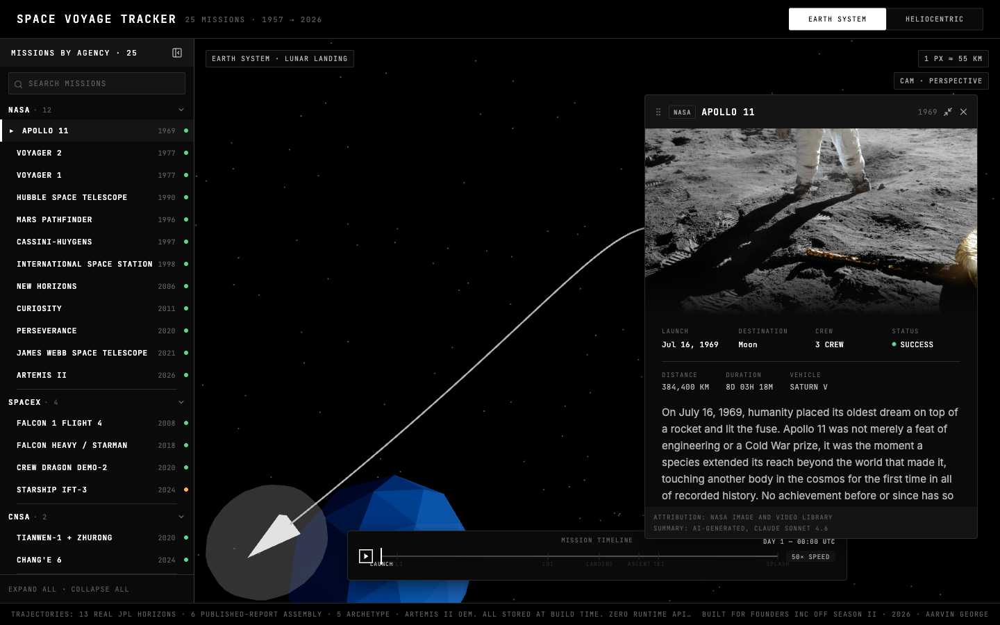
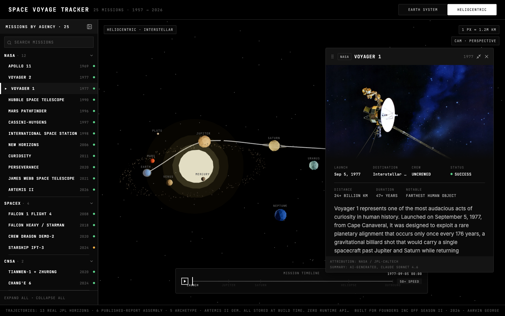
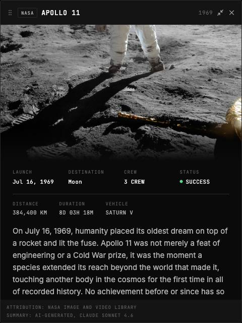
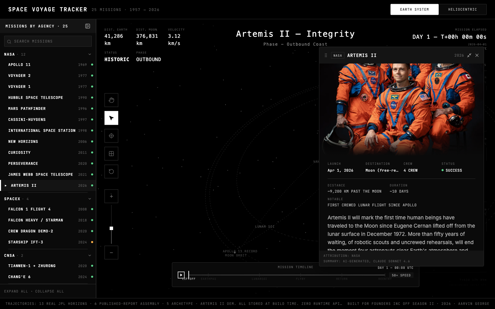
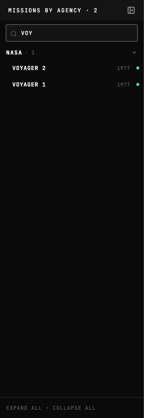

# Space Voyage Tracker

*An interactive 3D dashboard for humanity's spaceflight, free and forever.*

[](https://space-voyage-tracker.vercel.app)
[](LICENSE)

---

Sputnik 1 launched in 1957 and burned up in the atmosphere three months later. Voyager 1 has been moving away from us for forty-nine years and is now in interstellar space. James Webb is currently a million miles from Earth, photographing galaxies from when the universe was still forming. Twenty-three other missions, flown by humans across nine agencies and four countries, sit somewhere on that arc between launch pads and the edge of what we can reach.

Most of us, including engineers who build space technology for a living, can't name more than a handful of these missions. The information is real but scattered: NASA technical reports, JPL HORIZONS ephemeris files, Wikipedia citations, old documentary footage that nobody has indexed. There's no single place where a curious person can sit down for ten minutes and see what humanity has flown, where it went, and what came back.

**Space Voyage Tracker** is one person's attempt to build that place. Twenty-five missions you can pick from a sidebar. Trajectories rendered in 3D from real ephemeris data wherever possible. A 250-word summary for each mission, generated at build time so the dashboard stays fast and stays free. It is built for the curious. The 4-year-old asking what's beyond Mars. The retired engineer who worked on Cassini and wants to see the trajectory one more time. The teacher building a unit on the Cold War space race. The college student deciding whether to apply to JPL.

This is, openly, a noble endeavor. Knowledge of humanity's spaceflight should be freely accessible to anyone with an internet connection, and AI is at its best when used for projects like this.

> **[Open the live dashboard](https://space-voyage-tracker.vercel.app)**



---

## What you can do today

- **Pick any of 25 missions** from a sidebar grouped by agency. NASA, SpaceX, CNSA, Roscosmos, ESA, JAXA, ISRO, Blue Origin, and Inspiration4 are all represented.
- **See each mission's trajectory rendered in 3D**, sized to its actual scale relative to Earth, the Moon, the inner solar system, or interstellar space, depending on where the mission went.
- **Read a 250-word summary** of each mission, generated by Claude Sonnet 4.6 at build time from authoritative source material. Every summary is pre-baked and committed to the repository, so the dashboard makes zero LLM calls at runtime and remains free to host.
- **Scrub through the mission timeline** with a floating playback widget. Watch the spacecraft chevron travel along its trajectory at 1×, 2×, 5×, 10×, or 50× speed. Click any phase marker to jump.
- **Switch between Earth-system and heliocentric scene framing.** Apollo 11 makes sense as Earth + Moon. Voyager 1 makes sense as the Sun + the inner planets + an outbound arc that runs off-screen toward the edge of the solar system.
- **Watch Artemis II in something close to real time.** Artemis II is the only mission with a live telemetry overlay, drawing current state vectors from NASA's JPL HORIZONS system. When Artemis II is selected, the dashboard renders a full mission-ops HUD inspired by Apollo flight controllers' consoles.

> *"Houston, Tranquility Base here. The Eagle has landed."*
> — Neil Armstrong, July 20 1969, 20:17 UTC

## A look inside



*Voyager 1, selected from the sidebar. The Sun sits at the center; the inner planets are visible; Voyager 1's outbound trajectory runs off-screen.*



*The floating mission card for Apollo 11, showing the build-time-generated 250-word summary, key facts, hero image, and attribution.*



*Artemis II rendered with its full v0 mission-ops HUD: telemetry strip, mission identity, hardware controls, event timeline, and the trajectory-with-Earth-grid scene preserved from the upstream tracker.*



*Real-time search across all 25 missions. Type "voy" and the sidebar filters to Voyager 1 and Voyager 2. Keyboard navigation: Cmd+K focuses the search, ArrowUp/Down moves through results, Enter selects.*

## The 25 missions covered

| Agency | Mission | Year | Where it went |
|--------|---------|------|---------------|
| NASA | Apollo 11 | 1969 | Moon — first crewed landing |
| NASA | Voyager 1 | 1977 | Jupiter, Saturn, interstellar space |
| NASA | Voyager 2 | 1977 | Jupiter, Saturn, Uranus, Neptune |
| NASA | Hubble Space Telescope | 1990 | Low Earth orbit |
| NASA | Mars Pathfinder + Sojourner | 1996 | Mars surface |
| NASA | Cassini-Huygens | 1997 | Saturn + Titan |
| NASA | International Space Station | 1998 | Low Earth orbit |
| NASA | New Horizons | 2006 | Pluto + Kuiper belt |
| NASA | Curiosity | 2011 | Mars (Gale Crater) |
| NASA | Perseverance + Ingenuity | 2020 | Mars (Jezero Crater) |
| NASA | James Webb Space Telescope | 2021 | Sun-Earth L2 halo orbit |
| NASA | Artemis II | 2026 | Moon — first crewed flyby since Apollo |
| SpaceX | Falcon 1 Flight 4 | 2008 | Low Earth orbit, first private orbital launch |
| SpaceX | Falcon Heavy + Starman | 2018 | Heliocentric, near-Mars orbit |
| SpaceX | Crew Dragon Demo-2 | 2020 | ISS, first private crewed mission |
| SpaceX | Starship IFT-3 | 2024 | Suborbital, partial success |
| CNSA | Tianwen-1 + Zhurong | 2020 | Mars orbit + surface |
| CNSA | Chang'e 6 | 2024 | Lunar far side sample return |
| Roscosmos | Sputnik 1 | 1957 | Low Earth orbit, first artificial satellite |
| Roscosmos | Vostok 1 | 1961 | Low Earth orbit, first human spaceflight |
| ESA | Rosetta + Philae | 2004 | Comet 67P/Churyumov-Gerasimenko |
| JAXA | Hayabusa 2 | 2014 | Asteroid Ryugu sample return |
| ISRO | Chandrayaan-3 | 2023 | Moon south pole (first soft landing there) |
| Blue Origin | New Shepard NS-16 | 2021 | Suborbital, first Blue Origin crewed flight |
| — | Inspiration4 | 2021 | Low Earth orbit, first all-civilian crewed mission |

## What's real, what's approximated, what's not

Honesty about data fidelity is a feature, not a footnote. Here is exactly what each trajectory in the dashboard is sourced from:

- **13 missions use real JPL HORIZONS ephemerides** sampled at build time and stored as JSON. The trajectories are what NASA's spacecraft tracking system says the spacecraft actually did or is doing.
- **6 missions use trajectories assembled from published flight reports.** Sputnik 1, Vostok 1, Chandrayaan-3, Tianwen-1, Chang'e 6, Mars Pathfinder. The path shapes are correct; the per-second positions are interpolated from documented mission milestones.
- **5 commercial missions use mathematical archetype trajectories.** The four SpaceX missions and Inspiration4 are rendered as physically plausible Bezier curves based on the mission's launch profile. They are illustrative, not flight-grade.
- **Artemis II uses NASA's OEM trajectory file** combined with a live overlay polled from JPL HORIZONS in production. When Artemis II launches and starts returning state vectors, the live overlay reflects them.

Every trajectory was computed once at build time and committed to the repository. The dashboard makes **zero runtime API calls**. The cost of hosting is the cost of serving static files.

This disclosure appears in the dashboard's footer in production, exactly as stated above.

## Run it locally

```bash
git clone https://github.com/AarvinGeorge/space-voyage-tracker.git
cd space-voyage-tracker
npm install
npm run dev
```

The dev server starts at `http://localhost:5173`. The repository ships with all build-time data already generated and committed, so you can browse all 25 missions immediately without any API keys.

If you want to regenerate the mission summaries or fetch fresh trajectories, you'll need an Anthropic API key (for summaries) and outbound network access (for JPL HORIZONS). See the inline comments in `scripts/` for the build-time data pipeline. The key is read from a local `.env` file and is never committed.

## How it's built

A short architecture tour for the curious.

The frontend is **React 18 + TypeScript** running on **Vite**. 3D rendering uses **react-three-fiber** and **three.js** with `@react-three/drei` helpers. Styling uses **Tailwind CSS v4** with a custom token system inspired by mission-control terminals (pure black, monospace, layered greys, white for focus, red strictly reserved for live telemetry).

The mission data, hero images, and 250-word summaries are all pre-generated at build time by scripts in `scripts/` and committed to the repository. The build pipeline runs locally, not on the deploy host, so each Vercel deployment is a pure static rebuild with zero outbound API calls. Mission summaries are generated by **Anthropic Claude Sonnet 4.6**; hero images are sourced from the NASA Image and Video Library and Wikimedia Commons; trajectories come from JPL HORIZONS where available and from published flight reports otherwise.

The dashboard is deployed on **Vercel**. The live URL is [space-voyage-tracker.vercel.app](https://space-voyage-tracker.vercel.app).

> *"Look again at that dot. That's here. That's home. That's us."*
> — Carl Sagan, on the Voyager 1 "Pale Blue Dot" photograph

## Roadmap

Three stages, in order of distance from today.

**Stage 1 — Shipped (this version).** The dashboard you see today. 25 missions, 3D trajectories, mission summaries, the full Artemis II live-telemetry HUD, search, keyboard navigation, mobile responsive layout. Built and deployed.

**Stage 2 — Next: an AI guide.** A voice and chat assistant integrated into the dashboard. Ask "tell me about Voyager 1's planetary encounters" and hear a narrated response. Ask "which missions went to Mars?" and watch the sidebar filter. The intent is to make the dashboard interactive in a way that meets a curious person where they are, regardless of how much they already know.

**Stage 3 — Eventually: agentic auto-maintenance.** AI agents that watch real-world spaceflight news, identify new launches and milestones, fetch their trajectory data and metadata, and add them to the dashboard automatically. The dashboard becomes a living record of humanity's spaceflight, maintained by software, free at the edge.

Stages 2 and 3 are vision, not commitments. No dates promised. The work happens when the work happens.

## Contributing

Pull requests are welcome. The kinds of contributions that would be especially useful:

- Mission data corrections. If you know more about a particular mission than the summary or the trajectory reflects, open an issue with the source.
- New missions worth adding. The current 25 are a curated list of landmarks, not an exhaustive catalog. Suggestions for the next 25 are welcome.
- Accessibility fixes. The dashboard tries to be keyboard-navigable and screen-reader-friendly. Reports of where it fails are highly valued.
- Translations. Today the dashboard ships in English only. Localizations would help the "free and forever for anyone" mission considerably.

For larger changes, please open an issue first so we can talk through the approach before you write code.

## Acknowledgments

This project stands on a lot of shoulders.

- **[Tyush97/artemis-tracker](https://github.com/Tyush97/artemis-tracker)** — the upstream single-mission Artemis II tracker this project forked from. The Terminal Mission Control visual language, the live-data HUD, and the v0 3D scene are all inherited from this work.
- **[JPL HORIZONS](https://ssd.jpl.nasa.gov/horizons/)** — the source of every real spacecraft ephemeris in the dashboard.
- **[NASA Image and Video Library](https://images.nasa.gov)** and **[Wikimedia Commons](https://commons.wikimedia.org)** — the source of every hero image. Each image's specific credit appears in the dashboard's mission card footer.
- **[Anthropic](https://anthropic.com)** — the Claude Sonnet 4.6 model that generated the 25 mission summaries. The summaries are reviewed by a human and committed to the repository; the model is not called at runtime.
- **The agencies, engineers, and crews** who flew these missions in the first place. Several of these missions involved real risk to real people. This dashboard exists because their work did.

## License

[MIT](LICENSE) — use, modify, redistribute, attribute. The intent is that this knowledge stays free.

---

Built by [@AarvinGeorge](https://github.com/AarvinGeorge). Built for the curious.
